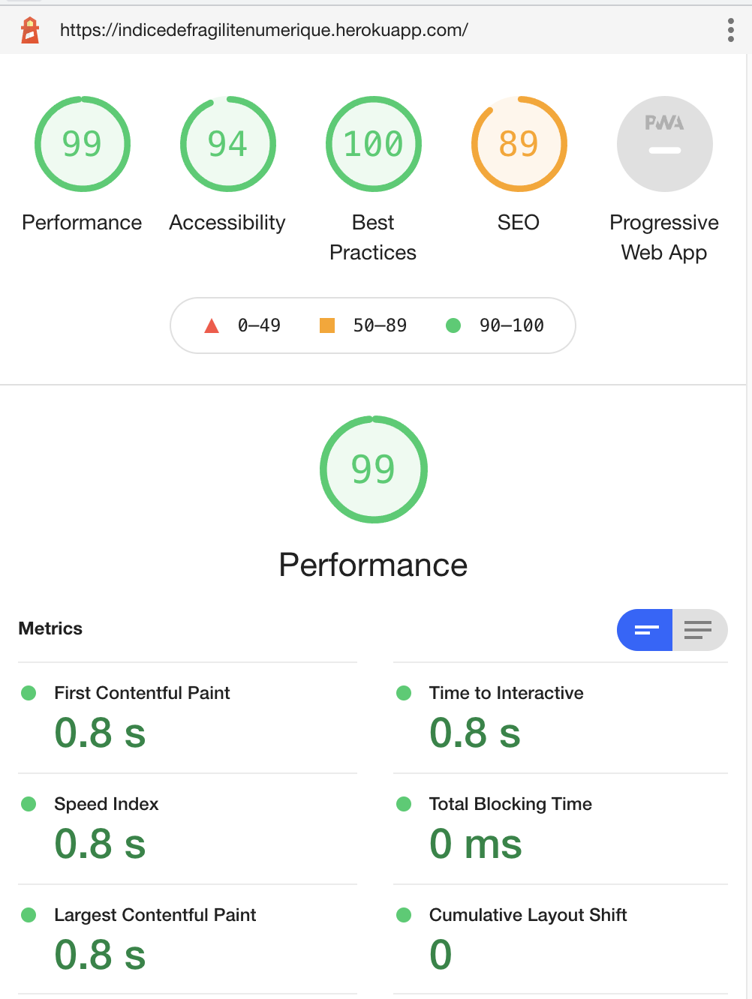

# Indice de Fragilité Numérique - Green IT
## **5IW1 - Groupe 7**
**Développeurs:**
- Jiovany VINCENT - jiovanyvincent.dev@gmail.com
- Cem BUYUK - cembuyuk7@gmail.com
### Site web: https://indicedefragilitenumerique.herokuapp.com/

### **Choix technologique:**
- Nodejs + Handlebars.js

Notre choix technologique s'est arrêté sur NodeJs et le moteur de template Handlebars.js, afin de limiter les appels avec un front séparé et de trop soliciter les serveurs. De plus cela nous évite de mettre en production un back et un front, pas de problème de cors etc.

D'ailleurs notre déduction s'est avéré concluante car nous obtenons un score GreenIT Analysis (+-)93,4% en production, donc un EcoIndex A.




Pour vérifier le score green it en détails, plusieurs possibilités soit:
- Via l'extension GreenIT Analysis (Chrome ou Firefox)
- Via l'extension Lighthouse (Chrome Firefox)
- Via le site web GTmetrix

### **Démarrer le projet avec la commande:**
```docker-compose up -d```

ou

```docker-compose up --build```

Adresse local: http://localhost:3001
